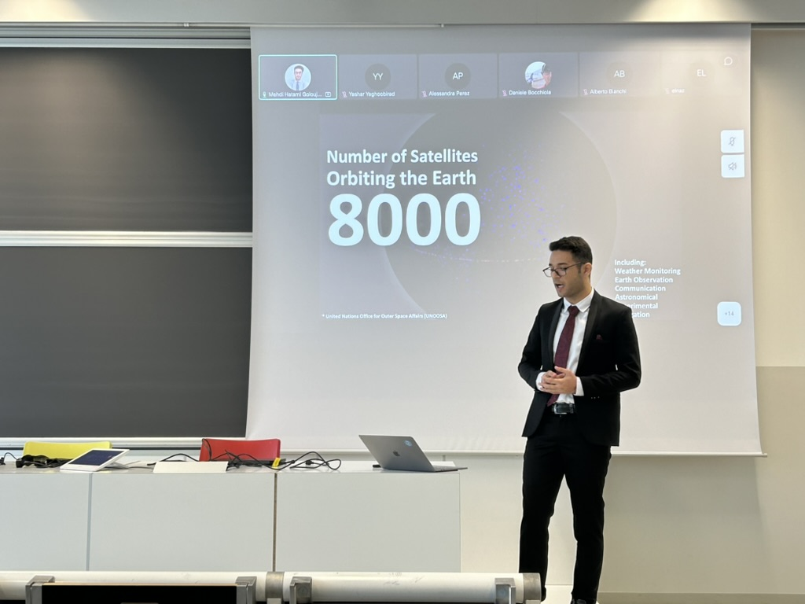

# Transfer Learning in Remote Sensing

Advanced machine learning techniques applied to remote sensing data for improved environmental monitoring and analysis.

**Tags:** Machine Learning, Remote Sensing, Transfer Learning

[Back to Featured Works](../featured-works.md) 